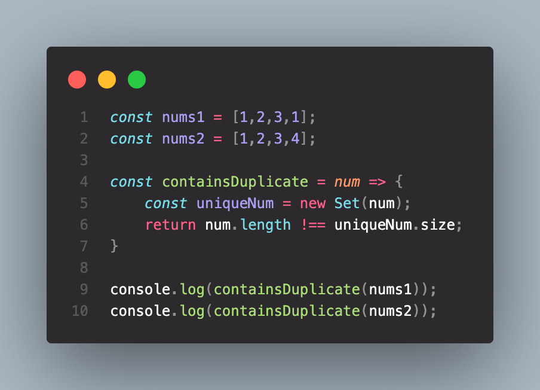

## 217. Contains Duplicate

**Given an integer array nums, return true if any value appears at least twice in the array, and return false if every element is distinct.**

***Example 1:*** 
Input: nums = [1,2,3,1] 
Output: true

***Example 2:***  
Input: nums = [1,2,3,4] 
Output: false

[LeetCode Submissions](https://leetcode.com/0xh3lt0n/)