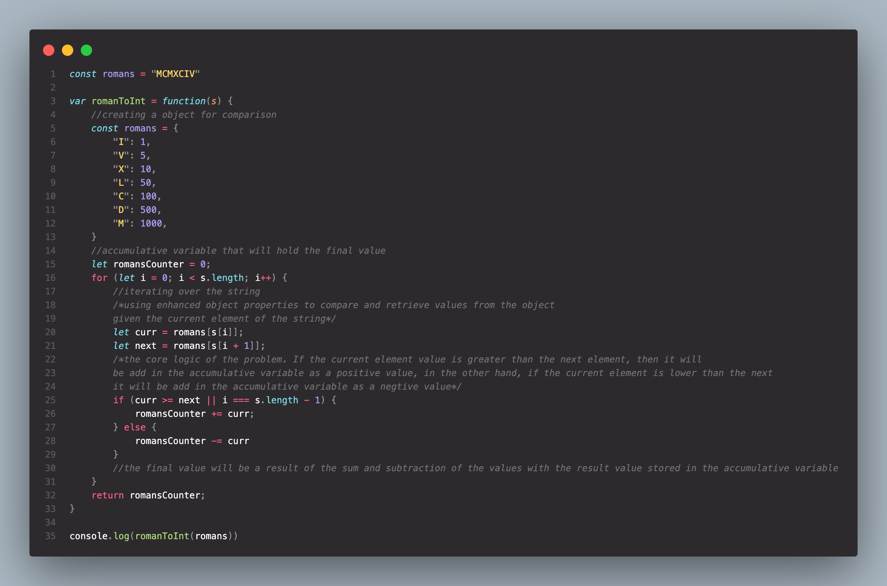

## 13. Roman To Integer

**GGiven a roman numeral, convert it to an integer.**

***Example 1:*** 
Input: s = "III" 
Output: 3

***Example 2:***  
Input: s = "LVIII" 
Output: 58

 

### [LeetCode Submissions](https://leetcode.com/0xh3lt0n/)